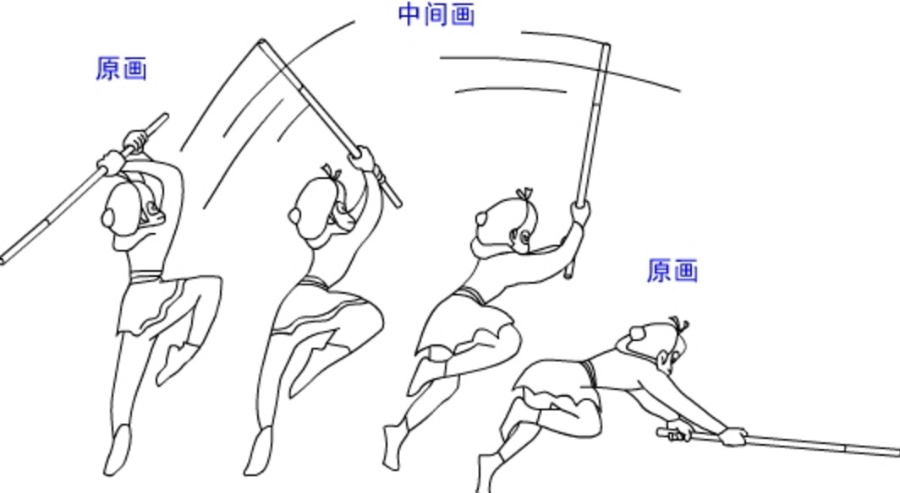
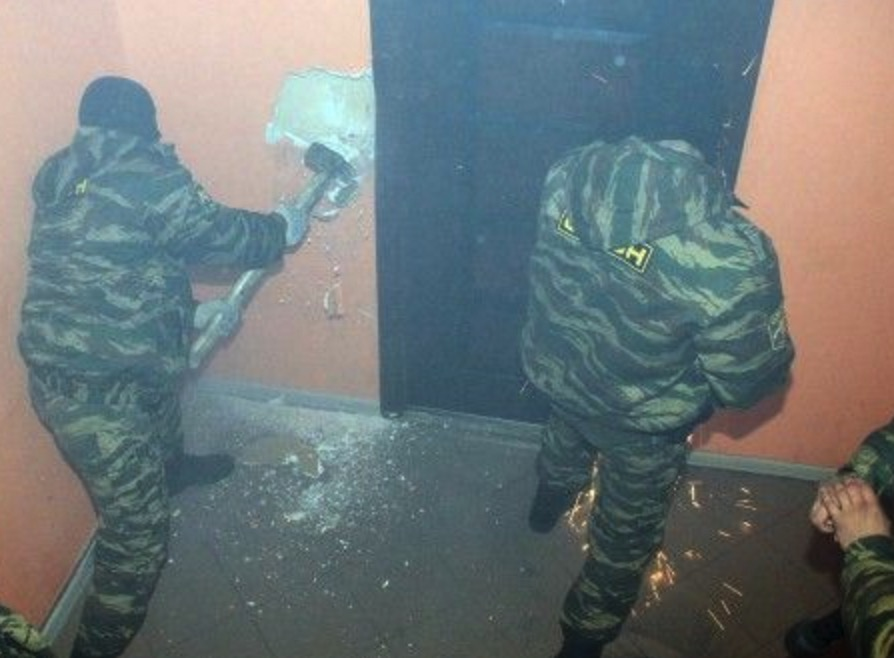
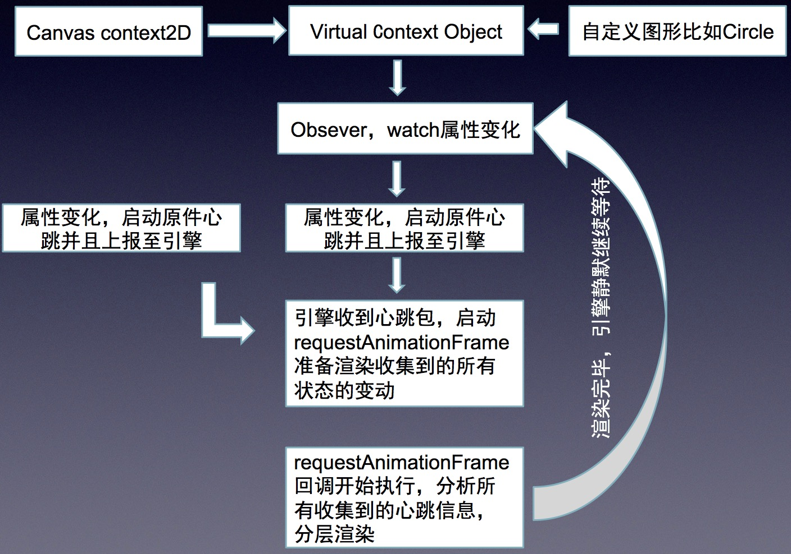

## 心跳包机制的由来

当画布上面的所有元素都有对应的对象树来持有结构的时候，接下来马上面临的一个问题就是对象树上面的任一节点有变动的时候如何把最新的画面重新绘制出来的问题。

canvas和svg最大的不一样的地方就是svg已经是以xml的格式在浏览器中渲染，其对象样式的变动都会由浏览器自动渲染出来，而canvax中的每个对象都是虚拟树中的节点，比如 bird.context.x=100 这样一只鸟的x到了100这个位置，这个仅仅是虚拟树中的这个对象的x属性变了，如果需要画面中的真实的鸟也移动到了这个位置，我们需要把整个画布全部clear掉重新绘制所有对象的最新状态（所有的二维动画其实都是不停的clear重绘，浏览器内部绘制svg应该也是这么个过程，就像我们以前看过的胶片电影）



如上面图中描述的过程一样，会呈现这个动画过程，就需要在四张胶片上面清空画布重新画上这个猴子的四个不同的状态。

那么，cavnas的这个clear-重绘-clear的过程，目前业内的canvas渲染框架以游戏引擎为代表的都是采用mainloop的渲染机制，mainloop的方案就是用一个定时器，按照固定的帧率不停的把画布clear然后重新绘制。

这是种简单粗暴但是又是有效的方案。



在游戏引擎里，这个无疑是唯一的选择，但是，在图表为代表的低频渲染场景中，我们真的需要用这么重的方案么？因为在图表这样的场景中，很多的时候，画布其实是处于静止状态的，当你和图表有交互的时候或者后台有新的数据push过来（比如股票系统）才需要重新绘制整个画布。

于是我们在寻找一种最合适图表这样低频场景的渲染方案。

技术方案的选型，真的有点像找对象，在合适的时候合适的场景找到合适的人。

从前面文章《Canvax中抽象的对象树》的DisplayObject介绍中，我们会发现，Canvax中所有和样式有关的属性我们都存放在了DisplayObject.context中，比如一只鸟，<code>bird.context.x</code> <code>bird.context.y</code> <code>bird.context.fillStyle</code>
    <code>bird.context.strokeStyle</code>等，而且所有的这些属性都是确定的预设好了的。

这个时候如果我们把每个DisplayObject的context属性用defineProperty来使它具备get，set的能力，这样，任何一个DisplayObject.context的属性变化都可以主动上报到引擎，引擎可以精确的知道哪些元素的哪些属性有了变化，而不用盲目的不管有没有元素有属性变化而采用mainloop不管三七二十一的不停渲染来的划算啊。

而且，引擎每次渲染的时候都已经收集到了所有有属性变动的元素和属性信息，在后续，如果要在这个基础上做”脏矩形“(<a href="http://orientye.com/2d-dirtyrect/" target="_blank">什么是脏矩形？</a>)优化的时候，有着天然的优势就是所有的脏数据已经有了，而不需要去做脏数据过滤对比。

顺便说个题外话，Canvax是完全兼容标准浏览器和ie8及以下哪些不支持canvas以及defineProperty特性的浏览器的，其中对canvas的补丁用的是[flashCanvas]()会在ie8-浏览器中自动输出flash格式来绘制，而对defineProperty的补丁，则吸取的是司徒正美的mvvm框架[avalon](https://avalonjs.github.io/)中的vbs解决方案。

## Canvax中的实现方案

所以我们的渲染方案是下面这个样子



这个方案的实现主要涉及到Canvax中的"canvax/core/propertyFactory","canvax/display/DisplayObject","canvax/display/Stage","canvax/index"四个模块。

### 定义好需要的属性到context

我们先从"canvax/display/DisplayObject"开始，在模块中有一个_createContext函数，这个函数就是用来聚合所有的context属性然后调用"canvax/core/propertyFactory"来构造一个具备get，set能力的读取器，这个聚合context属性的过程分两步，首先，定义一个_contextATTRS对象包含了目前用到了的所有canvas.context2d的属性，和canvax中自己定义的一些基本属性，x,y,width,height之类的，然后从用户传入的option.context做一次merge合并。

```js
var _contextATTRS = Base.copy( {
    width         : 0,
    height        : 0,
    x             : 0,
    y             : 0,
    scaleX        : 1,
    scaleY        : 1,
    scaleOrigin   : {
        x : 0,
        y : 0
    },
    rotation      : 0,
    rotateOrigin  :  {
        x : 0,
        y : 0
    },
    visible       : true,
    cursor        : "default",

    //canvas context 2d 的 系统样式。目前用到的就这么多
    fillStyle     : null,//"#000000",
    lineCap       : null,
    lineJoin      : null,
    lineWidth     : null,
    miterLimit    : null,
    shadowBlur    : null,
    shadowColor   : null,
    shadowOffsetX : null,
    shadowOffsetY : null,
    strokeStyle   : null,
    globalAlpha   : 1,
    font          : null,
    textAlign     : "left",
    textBaseline  : "top", 
    arcScaleX_    : null,
    arcScaleY_    : null,
    lineScale_    : null,
    globalCompositeOperation : null
} , opt.context , true );
```

然后，context的内容肯定不应该只有这么多，不同类型的元素都有一些自己特殊的属性，比如Circle圆，有个半径r属性是它特有的，也需要有通道加入到这个context里面来，所以我们会在后续所有需要一些自己特有属性的模块中定义一个_context。然后extend到_contextATTRS中。

```js
//然后看继承者是否有提供_context 对象 需要 我 merge到_context2D_context中去的
if (self._context) {
    _contextATTRS = _.extend(_contextATTRS , self._context );
}
```

好了，最后在_contextATTRS中定义一个watch。

```js
_contextATTRS.$watch = function(name , value , preValue){
    //所有的context属性的变化都会走这里，这里会把所有属性的变动上报给到它的stage
    this.$owner.heartBeat( {
        convertType:"context",
        shape      : this.$owner,
        name       : name,
        value      : value,
        preValue   : preValue
    });
}
```

最后，_contextATTRS中聚合好了所有的属性后，就需要把它调用"canvax/core/propertyFactory"来处理为具备get,set能力的读取器了。

```js
self.context = PropertyFactory( _contextATTRS );
```

### Stage收集到心跳上报到Canvax

其实Stage中做的事情不多，

```js
heartBeat : function( opt ){
    //shape , name , value , preValue 
    //displayList中某个属性改变了
    if (!this._isReady) {
       //在stage还没初始化完毕的情况下，无需做任何处理
       return;
    };
    opt || ( opt = {} ); //如果opt为空，说明就是无条件刷新
    opt.stage   = this;

    //TODO临时先这么处理, this.parent就是Canvax
    this.parent && this.parent.heartBeat(opt);
}
```

### Canvax收集所有心跳数据，组织渲染

Canvax有一个convertStages属性，是通过heartBeat方法记录收集到的心跳信息里分析出来的哪些stage中有哪些属性有变动的信息，在下一帧渲染的时候，只会渲染convertStages中有记录的stage。

同时heartBeat方法还有做一件很有意义的事情，就是判断当前渲染状态，如果当前项目正处于静默状态（比如折线图渲染完毕后，画面静止了），就会唤醒引擎告你引擎有活干了，该起床了，然后往requestAnimationFrame注册一帧，如果发现引擎已经起床了在准备干活了，那么就继续收集还会有哪些心跳包进来，分析好后添加对应的信息到convertStages中。

```js
if (!self._heartBeat){
   //如果发现引擎在静默状态，那么就唤醒引擎
   self._heartBeat = true;
   self.__startEnter();
} else {
   //否则智慧继续确认心跳
   self._heartBeat = true;
}
```


---广告分割线---

阿里妈妈开源图表库Chartx [http://thx.github.io/chartx/](http://thx.github.io/chartx/) ，求star