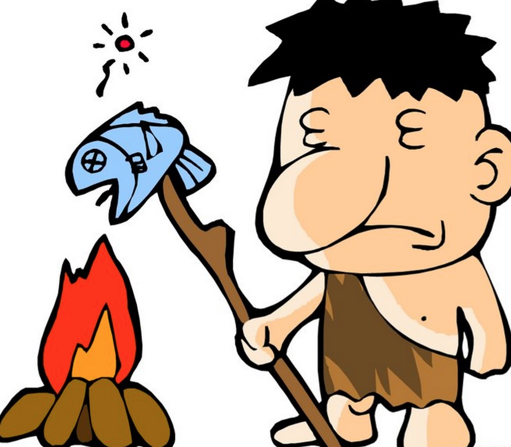

## 前言

要怎么样学习Canvas？

当你看完Canvas的api后你会发现传说中很强大的Canvas其实api不多，同时，平时dom开发中你经常用到的一些东西居然从头到尾没有找到。最基本的，绘制完一个元素后，回过头不知道该这么找到这个元素，然后我还想给它添加个click事件呢该怎么办？因为dom开发中这些都是在平常不过的了，甚至svg都很方便的完成这些事情。

习惯了dom世界的前端开发者会有困惑，我懂！

这些并不妨碍Canvas依然如传说中那样的强大，甚至我觉得Canvas的这些牺牲换来的正是换来他的强大的原因，做为一套较为底层的绘图接口，给开发者提供了更加灵活的使用方式。

Canvas本身api不多，也不难，这里就不做详细介绍，推荐一个不错的文档 [https://developer.mozilla.org/zh-CN/docs/Web/API/Canvas_API](https://developer.mozilla.org/zh-CN/docs/Web/API/Canvas_API)。

然而面对这简洁而不简单的绘图接口困惑的原因是在熟悉的生产环境中不知道这么去应用。所以，个人觉得学习Canvas最好的方式是大概的看下Canvas的api文档后，需要看一个具体的Canvas应用实例，这个系列blog会以Canvas渲染引擎《Canvax》为Canvas使用实例，通过分享整个实现过程和技术点，来让刚学Canvas和准备学习Canvas的同学了解怎么样来使用Canvas。

废话有点多，那么先介绍下Canvax是什么？

## Canvax是什么

Canvax是一套基于Canvas的渲染引擎，做为阿里妈妈图表库[Chartx](http://thx.github.io/chartx)的底层依赖。有类似as3的对象树结构，在不兼容Canvas的浏览器中比如 ie9- 则采用[flashCanvas](http://flashCanvas.net/)自动输出为flash格式，事件系统兼容了pc的mobile，pc端有实现拖拽，点击，双击，mouseover,mouseout,mousemove，mobile端则兼容了[hummer.js](http://hammerjs.github.io/)的全部手势...... 接下来会一一详细道来。

[https://github.com/canvax/canvax](https://github.com/canvax/canvax)，欢迎star

那么，问题来了，我们为什么开发Canvax?

## 为什么开发Canvax

每个工具或者框架，必然有着其特定的使命和初衷，我们决定采用cavnas来实现一套数据可视化工具库，就如上面有说到那样，原生canvas在生产环境中会有诸多不够方便的地方，所以，我们决定分两步走，先开发一套足够方便开发canvas的渲染引擎，然后在这个基础上继续搭建数据可视化工具库。

如果你这个时候问我那为什么不选择原生兼容dom的svg呢，那这个聊天就没法继续了，技术没有好坏，技术的选型我个人觉得就像搞对象，合适的场景，合适的时间发现合适的解决方案，就对了。我觉得在图表这样的场景中，还是canvas会比较适合。

## canvas的开发现状 

我们还是继续回来说说开发Canvax的原因，这主要要从我们现在原生canvas的开发现状说起。

我们面对原生canvas开发，其不便主要集中在下面几点：

1，无状态（绘制的任何元素都不会以对象的方式持有存储）。

2，没有对于canvas上面元素的点击检测 。（绘制的元素都没有结构化的持有，检查啥呢？）

3，因为1和2的原因所以更加没有元素的事件侦听处理。

4，需要手工渲染

这，这简直就是石器时代啊有木有！

## Canvax的使命 

那么Canvax的使命是：

针对惨不忍睹的现状，提供对应的解决方案：

1，把所有的元素对象抽象化状态 记录保持。(可以在canvas里面像操作dom一样的使用了，小激动有么有)

2，提供简单的点和这些元素的碰撞检测。（因为对象毕竟是抽象在内存里的，浏览器不会给你的这些抽象元素提供点击检测，所以，要靠自己）

3，建立个简单的事件系统和dom的事件系统对接，完成在元素上的事件分发，覆盖pc 和 mobile （同上，得靠自己）

4，实现一个最合适图表应用场景的渲染方案 （抽象的对象树，你删除了一个元素或者移动了一个元素，canvas是不知道的。所以需要实现一个渲染方案）

好了，我们根据上面的要解决的事情列表，一一道来。

首先，请看下一篇[Canvax中对象树的实现](treemap.html)！

---广告分割线---

阿里妈妈开源图表库Chartx [http://thx.github.io/chartx/](http://thx.github.io/chartx/) ，求star
