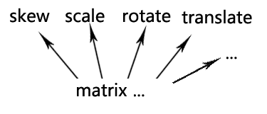
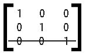
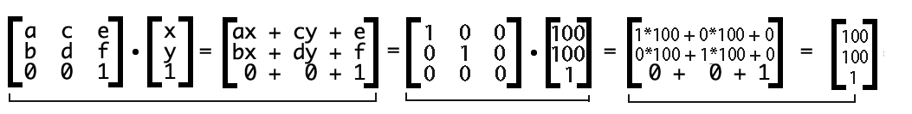

当对象树结构确定了后，接下来就是要面对如何实现元素的渲染位置，旋转，缩放等等一系列的形变问题了，在dom里我们熟悉的position:absolute||relative||fixed来配合left,top,right,bottom等属性来实现渲染位置，scale,rotate等css属性来实现缩放和旋转，那么在Canvax的抽象对象树里，我们如何来实现呢？

## 矩阵与形变

前端工程师的日常工作中还是比较少直接接触到一些数学方面的内容，所以毕业以后基本在学校学的那些数学知识基本还给老师了，但是在涉及到简单的图形开发领域，多少就会不可避免的接触到一些基本的数学内容，比如<code>矩阵</code>，<code>向量</code>，<code>三角函数</code>，<code>贝塞尔</code>等等。这些内容其实都在高中或者大学的线性代数里学到过，只是这些知识在读书的时候学起来很抽象很枯燥无味，所以很多基本一毕业就还给了老师，我也是，后面弄Canvax，需要用到这些知识，当这些以前读书时候学起来很无聊不知有啥用的东西在代码里用的到而且是结合五颜六色丰富多彩图形反馈出来的时候，本来抽象不好理解的东西一下具象起来才发现他们的魅力... 书到用时方恨少，这个时候是最深刻的体会拉。

那么回到正题上来，我们来说说canvas中的Matrix（矩阵）？

要战胜对手，首先要在战略上藐视对手，所以，一开始千万不要被这个名字吓住了。


如果你有兴趣从数学角度去了解矩阵的话，可以移步这里[理解矩阵Matrix （数学）](https://www.douban.com/group/topic/14452729/)，如果只想简单的从canvas对Matrix支持的角度来了解的可以继续往下看。

矩阵的本质是运动的描述，运动就会有形变，形变又可以简单的分为斜拉(skew)，缩放(scale)，旋转(rotate)以及位移(translate)等等。



## Canvas中的形变函数

canvas2D中已经给我们实现了几个基本的形变函数。

1，我们先介绍 translate 方法，它用来移动 canvas 和它的原点到一个不同的位置。

```js
translate(x, y)
```

translate 方法接受两个参数。x 是左右偏移量，y 是上下偏移量，如下图所示。


2，第二个介绍 rotate 方法，它用于以原点为中心旋转 canvas。

```js
rotate(angle)
```

这个方法只接受一个参数：旋转的角度(angle)，它是顺时针方向的，以弧度为单位的值。旋转的中心点始终是 canvas 的原点，如果要改变它，我们需要用到 translate 方法。


3，接着是缩放。我们用它来增减图形在 canvas 中的像素数目，对形状，位图进行缩小或者放大。

```js
scale(x, y)
```

scale 方法接受两个参数。x,y 分别是横轴和纵轴的缩放因子，它们都必须是正值。值比 1.0 小表示缩小，比 1.0 大则表示放大，值为 1.0 时什么效果都没有。
默认情况下，canvas 的 1 单位就是 1 个像素。举例说，如果我们设置缩放因子是 0.5，1 个单位就变成对应 0.5 个像素，这样绘制出来的形状就会是原先的一半。同理，设置为 2.0 时，1 个单位就对应变成了 2 像素，绘制的结果就是图形放大了 2 倍。

## transform

然后你会发现，canvas提供的这三个形变函数，远远不够啊，最基本的skew形变怎么办，canvas可没有提供skew方法啊，那就更加别说其他复杂的形变效果(比如镜像反转)啦，肿么办？别着急，主角该登场了<code>transform</code>。

transform，是相对于translate，rotate，scale这三个基本的方法更加底层的一个解决方案，他是直接来操作矩阵，所以理论上面它效率要比上述方法要更加高些。

```js
ctx.transform(a,b,c,d,e,f);
```
transform必须接受6个参数，但是我们为什么说它是直接操作矩阵的呢，这就是6个普通的参数而已嘛？而且，六个参数，如何记得住他们的意义啊。其实，这六个参数就是用来描述着一个矩阵的信息。它对应的矩阵就是：


所有的值都自己默认的单位值，比如数字的默认单位值就是0，那么默认的单位矩阵是什么样子的呢，或者可以这样理解一个单位矩阵，它就是一个图形,在没有缩放（没有缩放就是1）,旋转（没有旋转就是0）,位移（没有位移也是0）的时候,对应的矩阵就应该是这样的：



其中a位置和d位置的1，就分别代表了x轴方向和y轴方向的缩放，b和c位置的0分别代表的是x轴方向和y轴方向的斜切，最后e和f位置的0分表代表x和y轴方向的位移。

那么接下来我们要把这个图形移动到x=100,y=100的位置，就是transform(1,0,0,1,100,100)，从矩阵计算过程来看就是这样的：



那么也就是说，用前面说的canvas自己封装的接口ctx.translate(100,100)，和ctx.transform(1,0,0,1,100,100)是一样的，translate的底层其实也是对矩阵的操作。同时，虽然直接用transform稍微麻烦了点，但是现在你可以完成比如skew，镜像翻转等等一系列的形变了。

## setTransform

既然说到了transform，必须要提一下setTransform方法—-这个方法一看就是和transform一样的啦.不过他的作用是直接把矩阵设为你传给他的值,会清空前面所有的transform造成的效果;也就是说,transform的每次变化,都是在以前的矩阵上进行的(如果有的话).

比如我不知道之前我的canvas是否有过translate,rotate,skew等操作,我也没有save过,但我现在要操作canvas,画个矩形,如果之前有变化过,那么我画出来肯定就不对了,那么,我怎么才能保证我画出来的就是我想要的呢?没错就是setTransform。

## Canvax中的使用

好啦，废话那么多，希望你能懂我在说什么，我们接下来就要正经的说说Canvax里是如何应用的。

Canvax中完全摈弃了canvas提供的形变方法（吃力没讨好），直接所有的形变都采用transform来实现，比如现在有这么个场景，一个图形要位移到{x:100,y:100} ，旋转90angle， x轴方向缩放2倍，采用canvas提供的那些api的方案会是这样：

```js
//包行x,y,rotate,scale等信息
var opt = {
    x:100,y:100,rotate:90,
    scale:{
        x : 2,y:2
    }
}; 


if( opt.x || opt.y ){
    ctx.translate( opt.x , opt.y );
}
if( opt.rotate ){
    ctx.rotate( opt.rotate );
}
if( opt.scale ){
    ctx.scale( opt.scale.x , opt.scale.y )
}
```

这样看上去好像很合理，但是Canvax中全部采用transform后是这样(下面的方法在Canvax/display/DisplayObject模块中)：


```js
_updateTransform : function() {
    var _transform = new Matrix(); //我们新建一个Matrix对象
    _transform.identity();  //把这个对象初始化为一个默认的矩阵单元值
    var ctx = this.context;
    //你会看到后续的所有形变都是直接操作这个矩阵，而不再去操作canvas.context2D
    //是否需要Transform
    if(ctx.scaleX !== 1 || ctx.scaleY !==1 ){
        //如果有缩放
        //缩放的原点坐标
        var origin = new Point(ctx.scaleOrigin);
        if( origin.x || origin.y ){
            _transform.translate( -origin.x , -origin.y );
        }
        _transform.scale( ctx.scaleX , ctx.scaleY );
        if( origin.x || origin.y ){
            _transform.translate( origin.x , origin.y );
        };
    };

    var rotation = ctx.rotation;
    if( rotation ){
        //如果有旋转
        //旋转的原点坐标
        var origin = new Point(ctx.rotateOrigin);
        if( origin.x || origin.y ){
            _transform.translate( -origin.x , -origin.y );
        }
        _transform.rotate( rotation % 360 * Math.PI/180 );
        if( origin.x || origin.y ){
            _transform.translate( origin.x , origin.y );
        }
    };

    //如果有位移
    var x,y;
    if( this.xyToInt ){
        var x = parseInt( ctx.x );//Math.round(ctx.x);
        var y = parseInt( ctx.y );//Math.round(ctx.y);
    } else {
        x = ctx.x;
        y = ctx.y;
    };

    if( x != 0 || y != 0 ){
        _transform.translate( x , y );
    };
    this._transform = _transform;
    return _transform;
}
```

这样的话，你会发现，所有的形变都是在这个内部创建的矩阵单元上面操作，不会再去直接操作canvas.context2D，然后把最后运算后的矩阵存在DisplayObject的_transform属性上，也就是说每个Canvax元素都会有个_transform来记录自己的所有形变运动信息。在真正render的时候执行

```js
_transformHander : function( ctx ){
    var transForm = this._transform;
    if( !transForm ) {
        transForm = this._updateTransform();
    };
    //运用矩阵开始变形
    ctx.transform.apply( ctx , transForm.toArray() );
    //ctx.globalAlpha *= this.context.globalAlpha;
}
```

最后，因为我们全部是通过Matrix来实现的，所以我们<code>Canvax/geom/Matrix</code>模块中定义自己实现了目前够用的一些形变函数，包括scale,rotate,translate，有兴趣可以去看看。


有了前面的这些内容，我们可以完成一次完美的画面渲染，接下来我们要说说Canvax中比较有意思的点，[心跳包主动渲染机制](./heart_beat.html)。

---广告分割线---

阿里妈妈开源图表库Chartx [http://thx.github.io/chartx/](http://thx.github.io/chartx/) ，求star

