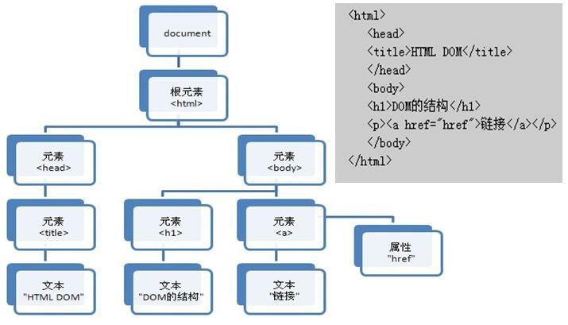
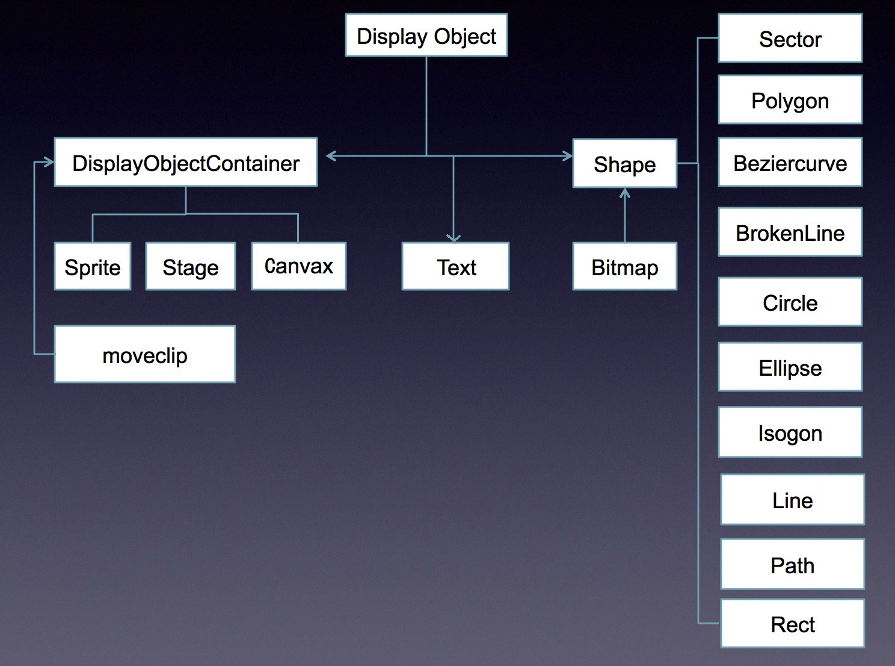
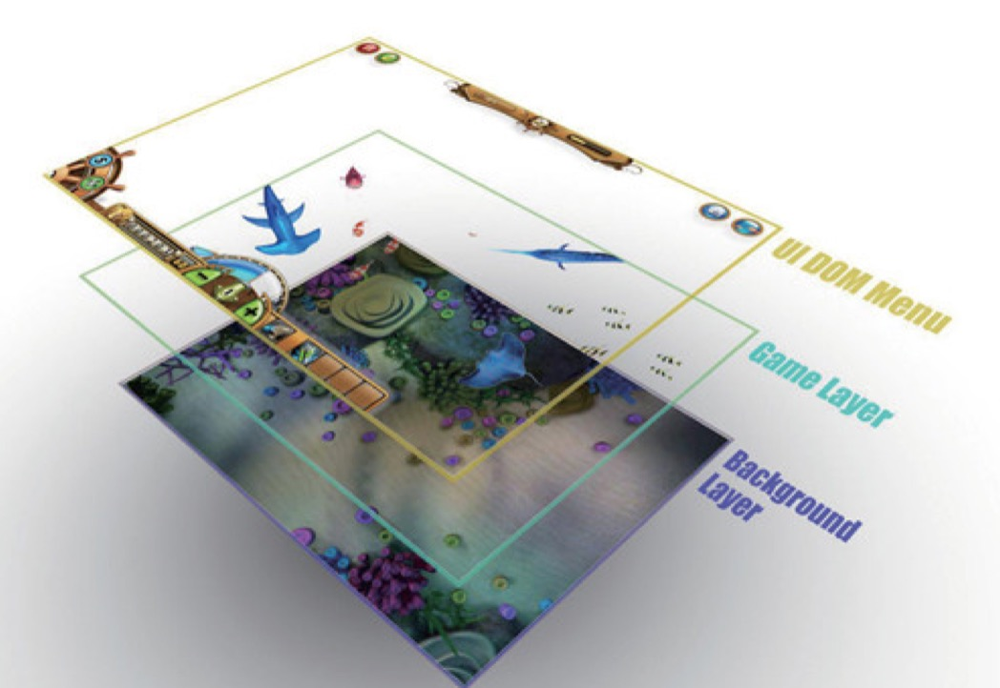
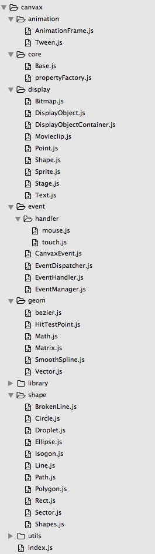

说起对象树，大家首先想到的肯定是DOM树。



前端开发同学对上面的结构在熟悉不过了吧，吃饭的家伙。

但是在canvas中没有这样的结构存在，它所有的绘制都是无状态的，比如阳光沙滩上面写生的少女，在画板上面绘制了海鸥，然后描绘冲浪的浪人，然后又偷偷加上了在水里激情的情侣，所有的这些对象，画上去了后，他们便成了一个整体，画板并没有结构化的保存起来告诉你这些内容。

这，从canvas画布的角度来讲是合理的，但是从前端开发应用的角度来讲，就会有所不便了。

于是我们选择参考as3的 DisplayObject 的 List结构来构建一套虚拟的对象树，来保存我们在画布上面绘制的所有信息。

我们先来瞅一眼参考了as3的对象列表后的Canvax DisplayObject List 的样子



可以看到，参考的as3最核心的两个模块的设计--<code>DisplayObject</code> and <code>DisplayObjectContainer</code>，我们接下来主要就是看看如何通过这两个类模块来完成树结构的构建和渲染。

## DisplayObject

其中，DisplayObject做为整个对象树系统的基类，它定义了对象系统中每个元素都要具备的最基本的属性和方法。

### 属性

其中属性主要有两个大块。

1,虚拟context对象

这个是Canvax渲染的一个核心部分，[虚拟context对象](javascript:;)聚合了大部分目前canvax中到用的的Canvas.context2D的属性，以及DisplayObject在Canvax世界中定义的基本的和样式有关的数据，比如width,height,x,y,visible,cursor... 基本上所有设计到样式的部分属性都被聚合到了这里。

2,基本属性

除[虚拟context对象](javascript:;)外的所有其他属性，其中有比如id，parent，dragEnabled（是否启用该元素的拖拽）... 


__ 所以，在Cavanx的世界里，每个元素都会有一套下面这样的属性：__

~~~js
{
    context : { //虚拟context对象部分
        //这里也包括两部分
        //1，从canvas.context2d聚合过来的目前Canvax中有用到的属性集合
        fillStyle     : null,//"#000000",
        lineCap       : null,
        strokeStyle   : null, 
        ...

        //2，Canvax世界中定义的和样式相关的所有属性
        width         : 0,
        height        : 0,
        x             : 0,
        y             : 0,
        scaleX        : 1,
        scaleY        : 1,
        ...
    },

    //然后其他所有和样式无关的基本属性就直接列在对象的属性列表里，不在写入上面的context中
    id: '我是id',
    parent: '我的这个元素的parent',
    dragEnabled : false //是否要启用这个元素的拖拽特性
    ......
}
~~~

### 方法

canvax中所有元素的基本方法也都定义在DisplayObject中，被其他模块继承使用，包括clone，getCurrentWidth，getCurrentHeight，getStage，localToGlobal，globalToLocal，localToTarget，toBack，toFront，animate，destroy，render等，其中render方法在DisplayObject以一个空函数存在并不提供具体的实现，由继承它的模块各自派生实现。

虽然DisplayObject中会定义一个render空函数，但是DisplayObject中还会有定义了一个非常有用的<code>_render</code>函数，这个函数中定义了真实的渲染过程，为什么要在DisplayObject中定义 一组 render , _render 这样的搭配呢，这个在接下来会讲，但是我们可以先看看_render的内容：

```js
_render : function( ctx ){  
    if( !this.context.visible || this.context.globalAlpha <= 0 ){
        return;
    }
    ctx.save();
    this._transformHander( ctx );

    //文本有自己的设置样式方式
    if( this.type != "text" ) {
        Base.setContextStyle( ctx , this.context.$model );
    }

    this.render( ctx );
    ctx.restore();
}
```

## DisplayObjectContainer

DisplayObjectContainer，看字面意思应该猜到了， 就是一个容器，但是首先它也是一个Canvax元素，所以它也是继承自DisplayObject，那么DisplayObjectContainer是如何让自己具备做为一个容器的能力呢？这主要是在它上面定义了很重要的一个属性以及围绕这个属性展开的一系列方法，这个属性就是<code>children</code>，是一个数组，然后用来操作这个children属性的方法有addChild，addChildAt，removeChild，removeChildAt，removeChildById，removeAllChildren，getChildById，getChildAt，getChildIndex，setChildIndex 最后还有一个覆盖实现的render函数。

所以这个container你可以看到要个这样的结构：

```js
DisplayObjectContainer = DisplayObject.extend({
    children : [],
    addChild : function(@params){
        //往this.children中添加一个元素
    },
    removeChild : function(@params){
        //从this.children中删除一个元素
    },
    getChildById : function(id){
        //从this.children中根据id找到一个元素
    },
    ......

    render : function( ctx ) {
        for(var i = 0, len = this.children.length; i < len; i++) {
            this.children[i]._render( ctx );
        }
    }
})
```

## Stage

Stage类， 再as3中，Stage则代表整个舞台。是唯一的根节点，但是再canvax中，因为分层设计的需要。stage 舞台同样代表一个canvas元素，但是在整个引擎设计里面， 不是唯一的根节点。而是会交由canvax类来统一管理其层级关系。

Stage中主要干两件事情，初始化canvas元素的尺寸：

```js
initStage : function( context2D , width , height ){
   var self = this;
   self.context2D = context2D;
   self.context.width  = width;
   self.context.height = height;
   self.context.scaleX = Base._devicePixelRatio;
   self.context.scaleY = Base._devicePixelRatio;
   self._isReady = true;
}
```

以及该canvas元素的渲染：
```js
render : function( context ){
    this.stageRending = true;
    this.clear(); //清除画布
    Stage.superclass.render.call( this, context ); //把最新的状态绘制上去
    this.stageRending = false;
}
```

## Canvax

渲染引擎主类，主要完成三件事情：

1.根据外界传入的宿主dom节点来初始化项目环境（每个Canvax项目都必须依附在一个具备layout的dom元素里），包括建立好tip的存储节点和后续所有stage对应的canvas元素会被添加到的dom节点，整个Canvax项目的dom目录结构会是这样的：

如果html中有这么一个节点

```html
    <div id="canvax-test"></div>
```

把这个节点id传给Canvax后，Canvax会在这个基础上构建这么一个结构

```html
    <div id="canvax-test">
        <div class='canvax-c'>
            <canvas id='stage1'></canvas>
            <canvas id='stage2'></canvas>
            ......这个可能添加多个stage，都是position:absolute 堆叠起来
            <div class="canvax-dom-container"></div>
        </div>
    </div>
```


2.从上面的结构会发现，一个项目里是可能有多个canvas元素的，为什么不是所有的内容都画在一个canvas上面呢，这里就主要是用到了一个叫做"分层渲染"的优化方案，什么是分层渲染？可以先看下下图来增加理解：



从这个图上面的游戏界面可以看到，我们可以把一个画布中的内容，根据其绘制的帧率要求做个简单的分层，比如最上面的按钮层，基本上是用户主动点击才会触发到状态改变才会需要重新渲染，中间的很多鱼在游动的精灵层，这个是对渲染帧率要求最高的层，里面的鱼都是在不停的游动，每个鱼元素的状态都需要及时更新到画布，而最下面的背景层，就基本上没一个场景只需要绘制一次就ok了，这就是分层渲染优化方案。

同时Canvax作为整个对象树的顶层，负责管理所有的stage对应的canvas，因为canvas已经是具体的dom对象，所以Canvax会提供 
```js
_afterAddChild : function( stage , index ){
    
}
```
 和 
```js
 _afterDelChild : function( stage ){

 }
```
函数来完成真实的add 和 remove 操作。

3.最后Canvax提供heartBeat接口来收集所有从不同stage上传过来的心跳包，然后 _startEnter接口调用AnimationFrame.registFrame把 _enterFrame注册到待执行帧队列里（具体的心跳包渲染技术在后面文章详细说明），完成整个项目的渲染。

-----------------------------------------------

好了。我们这里讲到的DisplayObject，DisplayObjectContainer，Stage，Canvax组成了我们Canvax渲染引擎最基本的DisplayList的类视图结构，继续回到开头说的阳光沙滩的写生少女，把画板支好，放上一张or几张画纸，那么我们的Canvax环境就初始化好了，放了几张画纸就是创建了几个stage（假设画纸是透明的，可以在最地下一张画纸上面画沙滩和海滩，上面的画纸依次画海鸟和嬉戏的人）

你可以创建一个沙滩的stage，一个海洋的stage，一个天空的stage，然后你要画上一只鸟， 就是创建了一个DisplayObject对象，addChild到天空的stage中，这只鸟从天空中划过，就是这个对象的DisplayObject.context.x 和 DisplayObject.context.y在不停的变化，如果有一队鸟从空中飞过，一会排成一个一字一会排成一个人字，那么你可以创建一个DisplayObjectContainer并把该container addChild到天空stage中，然后把鸟addChild到这个container中，不停修改这个container.context.x 和 container.context.y.....


## demo

嗯，上面的类比虽然我觉得还算形象，但是可能还是有些费解，我们还是来个正式的demo吧。

### 准备工作

1，准备一个amd ，cmd等任意一个模块加载环境。2，准备一个具备高宽的DOM

```html
<!DOCTYPE html>
<head>
    <meta charset="utf-8">
    <title>Canvax</title>
    <!-- 这里用requirejs来做模块加载器 -->
    <script src="http://requirejs.org/docs/release/2.1.20/minified/require.js"></script>
    <script>
        //这里已我的cdn版本2015.08.12为例
        var canvaxUrl     = "http://g.tbcdn.cn/thx/canvax/2015.08.12/";
        requirejs.config({ paths: {
            canvax : canvaxUrl    
        } });
    </script>
</head>
<body>
    <!-- 为Canvax准备一个具备大小（宽高）的Dom -->
    <div id="canvaxTest" style="width:600px;height:300px;"></div>
</body>
```

### 开始绘图，画一个圆

效果如下：

<script src="http://requirejs.org/docs/release/2.1.20/minified/require.js"></script>
<script>
    //这里已我的cdn版本2015.08.12为例
    var canvaxUrl     = "http://g.tbcdn.cn/thx/canvax/2015.08.12/canvax";
    requirejs.config({ paths: {
        canvax : canvaxUrl    
    } });
</script>
<div id="canvaxTest" style="width:600px;height:200px;"></div>
<script>
    require(["canvax/index" , "canvax/shape/Circle"] , function( Canvax , Circle ){
        //在dom树中准备一个具备Layout的容器节点
        var el = document.getElementById("canvaxTest");

        //用这个具备Layout的节点来创建Canvax项目对象
        canvax = new Canvax({
          id : "canvax", //注意，Canvax的世界里面，所有的id都是可选的，但是不能重复。
          el : el 
        });

        //然后就是创建第一个舞台对象Stage,在canvax的世界里，一个Stage就对应着一个canvas
        stage = new Canvax.Display.Stage({ });

        //ok，然后把stage添加到Canvax中管理。然后在stage中添加具体的图形元素
        canvax.addChild(stage);

        //好吧，我们来创建一个圆形，然后添加到stage中，然后给这个圆形添加点事件看看
        var circle = new Circle({
          context : {
            x:100,
            y:100,
            r : 50,
            fillStyle   : 'rgba(220, 20, 60, 0.5)',          // rgba supported
            strokeStyle : 'rgba(220, 20, 60, 0.9)',
            lineWidth   : 2
          }
        });

        //ok然后把这个画好了的圆，添加到舞台中去
        stage.addChild(circle);

    });
</script>

### 完整代码：

下面代码可以拷贝到你本地另存一份html预览效果。

```js
<!DOCTYPE html>
<head>
    <meta charset="utf-8">
    <title>Canvax</title>
    <!-- 这里用requirejs来做模块加载器 -->
    <script src="http://requirejs.org/docs/release/2.1.20/minified/require.js"></script>
    <script>
        //这里已我的cdn版本2015.08.12为例
        var canvaxUrl     = "http://g.tbcdn.cn/thx/canvax/2015.08.12/canvax";
        requirejs.config({ paths: {
            canvax : canvaxUrl    
        } });
    </script>
</head>
<body>
    <!-- 为Canvax准备一个具备大小（宽高）的Dom -->
    <div id="canvaxTest" style="width:600px;height:300px;"></div>
    <script>
        require(["canvax/index" , "canvax/shape/Circle"] , function( Canvax , Circle ){
            //在dom树中准备一个具备Layout的容器节点
            var el = document.getElementById("canvaxTest");

            //用这个具备Layout的节点来创建Canvax项目对象
            canvax = new Canvax({
              id : "canvax", //注意，Canvax的世界里面，所有的id都是可选的，但是不能重复。
              el : el 
            });

            //然后就是创建第一个舞台对象Stage,在canvax的世界里，一个Stage就对应着一个canvas
            stage = new Canvax.Display.Stage({ });

            //ok，然后把stage添加到Canvax中管理。然后在stage中添加具体的图形元素
            canvax.addChild(stage);

            //好吧，我们来创建一个圆形，然后添加到stage中，然后给这个圆形添加点事件看看
            var circle = new Circle({
              context : {
                x:100,
                y:100,
                r : 50,
                fillStyle   : 'rgba(220, 20, 60, 0.5)',          // rgba supported
                strokeStyle : 'rgba(220, 20, 60, 0.9)',
                lineWidth   : 2
              }
            });

            //ok然后把这个画好了的圆，添加到舞台中去
            stage.addChild(circle);

        });
    </script>
</body>
```

## Canvax目录结构

我们看看Canvax的文件目录结构，后面我们说到一些模块的时候好知道它在哪个位置



树结构有了后，树上面的每个节点的位置，旋转，缩放等，就是我们接下来要说的，[Canvax中的Matrix](./matrix.html)


---广告分割线---

阿里妈妈开源图表库Chartx [http://thx.github.io/chartx/](http://thx.github.io/chartx/) ，求star


